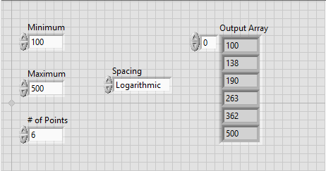
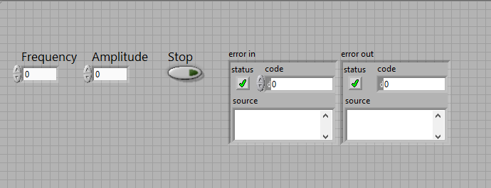
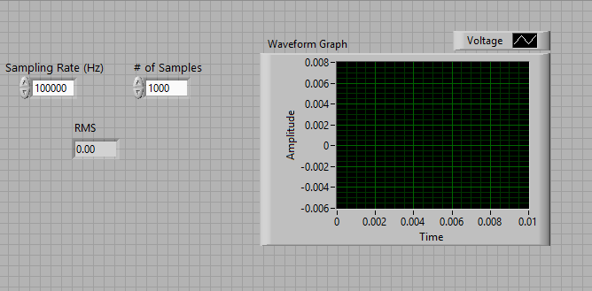
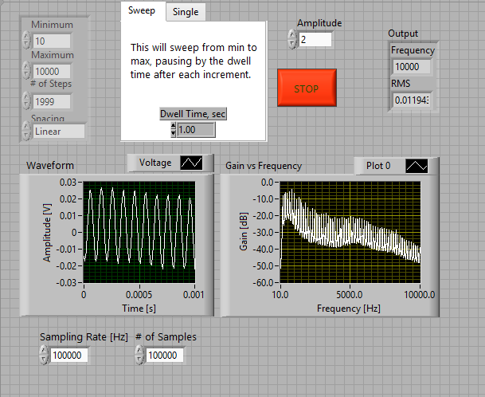

In this exercise, you will write 4 VIs that measures the response of [Kundt's Tube](http://en.wikipedia.org/wiki/Kundt's_tube). We are gonna use first 3 VIs as a subVIs, so connect terminals.

0) Create a project from LabView menu. We are going to use this project as our container, all the VIs created will be created in this project.

1) Write a VI called CreateIntegerArray that creates an array with given minimum, maximum and number of points. It also should be able to select between linear and logarithmic spacing. It should always have integer outputs.

2) Write a VI called SignalGenerator that generates a sine wave with given frequency and amplitude and outputs from AO. You can take a look at Problem 4.6 (Bode Magnitude Plot), for detailed instructions.

3) Write a VI called MeasureRMS that measures an analog signal from AI with given sampling rate and number of samples, and outputs a waveform and rms value for measured signal. You can take a look at Problem 4.6 (Bode Magnitude Plot), for detailed instructions.

4) Now, we are going to put all this together into our main VI called KundtsTube. This VI should get user input for either a sweep or a single frequency signal generation. Use CreateIntegerArray for sweep and use SignalGenerator to generate the signal.

To measure the response, use MeasureRMS and output your results as Gain vs Frequency. Also, use the VI that you created for saving spreadsheets to save your results at the end. The text file should include two columns: frequency and gain.

This VI should also have dwell time for sweeping frequencies.

Before uploading your finished project, make your results default from edit menu.
